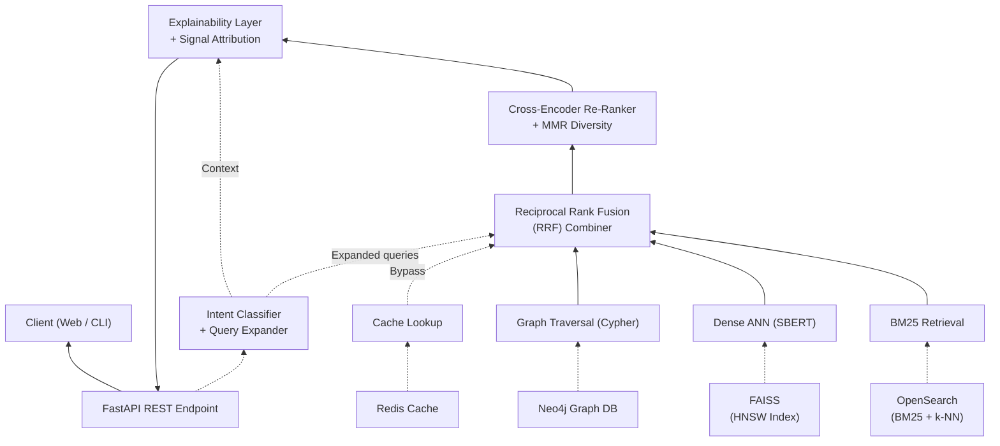

# Hybrid Retrieval System Architecture

---

### Layer-by-Layer Explanation

#### 1. Interface Layer `Client (Web / CLI)` & `FastAPI`
*   **What it does:** This is the entry and exit point of your system. 
*   **How it works:** The user types a query (e.g., "Need a cloud developer") into the React/Next.js frontend. The client sends a REST API request to the FastAPI backend. Finally, the FastAPI backend sends the final list of top candidates and explanations back to the user.

#### 2. Intent & Expansion Layer `Intent Classifier + Query Expander`
*   **What it does:** It understands what the user actually wants before searching.
*   **How it works:** The very first thing FastAPI does when it gets a query is pass it here. An LLM expands "cloud developer" into a structured list: `["Cloud Developer", "AWS", "Azure", "GCP"]`. It passes this expanded list down to the RRF and Retrieval layers so they know exactly what to look for.

#### 3. Explain Layer `Explainability Layer + Signal Attribution`
*   **What it does:** It generates the human-readable text explaining *why* a candidate matched.
*   **How it works:** It uses "Signal Attribution" (which means looking at the exact database that triggered the match, like Neo4j finding a soft skill) and feeds it into an LLM. The LLM writes: *"Match score 95%. Selected because their Azure skills specifically match your requirement for Cloud Development."*

#### 4. Re-Rank Layer `Cross-Encoder Re-Ranker + MMR Diversity`
*   **What it does:** It takes the Top 50 results from the databases and perfects the top 10.
*   **How it works:** 
    *   **Cross-Encoder:** A smart AI model reads the Candidates side-by-side with the query to give a final highly-accurate score.
    *   **MMR Diversity:** It makes sure the top 10 results aren't all identical clones of each other, providing the recruiter with a *diverse* set of great candidates.

#### 5. Fusion Layer `Reciprocal Rank Fusion (RRF)`
*   **What it does:** The mathematical combiner.
*   **How it works:** Because your system searches 3 different databases at once, it gets 3 different lists back. RRF mathematically combines the scores. If a candidate was ranked #1 in Elastic and #3 in FAISS, RRF merges those scores and pushes that candidate to the top of the master list.

#### 6. Retrieval Layer `BM25`, `Dense ANN`, `Graph`, `Cache`
*   **What it does:** The individual software functions running the searches.
*   **How it works:** 
    *   **BM25 Retrieval:** Creates the strict keyword search query.
    *   **Dense ANN:** Passes the query to SBERT to turn it into mathematical vectors.
    *   **Graph Traversal:** Generates the Cypher query.
    *   **Cache Lookup:** Checks if this exact search was run recently to save time.

#### 7. Storage Layer `OpenSearch`, `FAISS`, `Neo4j`, `Redis`
*   **What it does:** The actual databases living on your hard drive / server.
*   **How it works:** 
    *   **OpenSearch:** Fast text indexing database.
    *   **FAISS:** Facebook's database designed to store math arrays (Vectors).
    *   **Neo4j:** Graph database storing candidate nodes tied to skill nodes via relationship edges.
    *   **Redis:** Simple memory cache (e.g., `if query == "Python" return final_json_immediately`).
